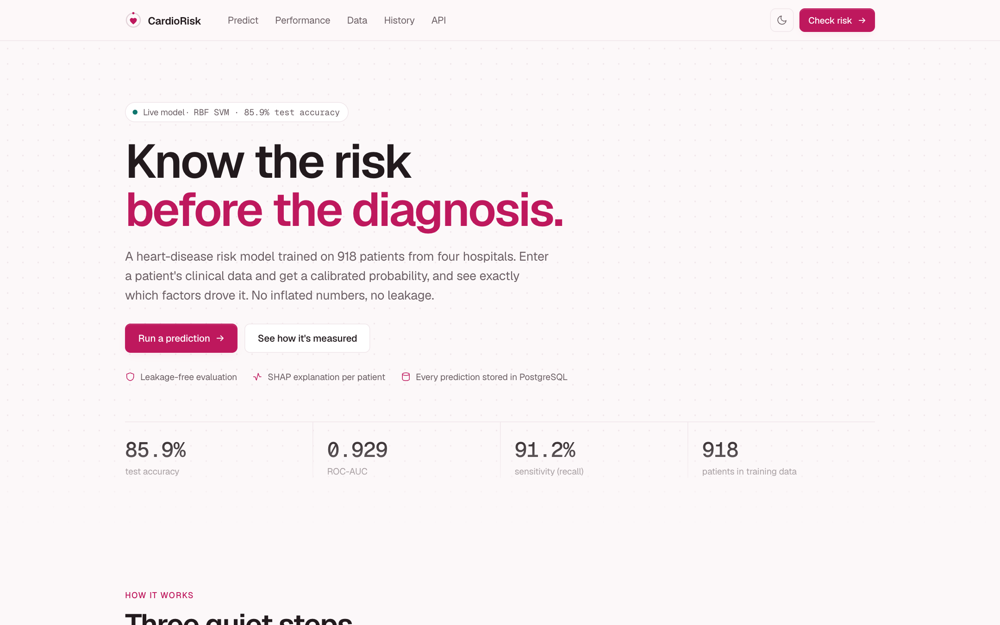
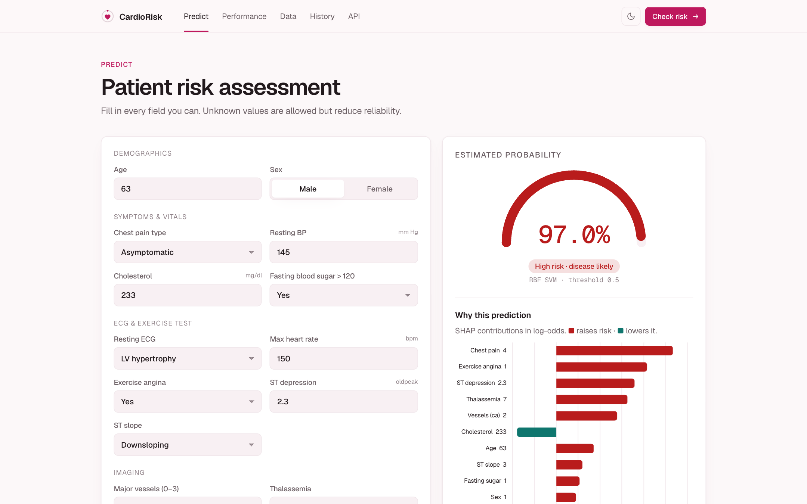
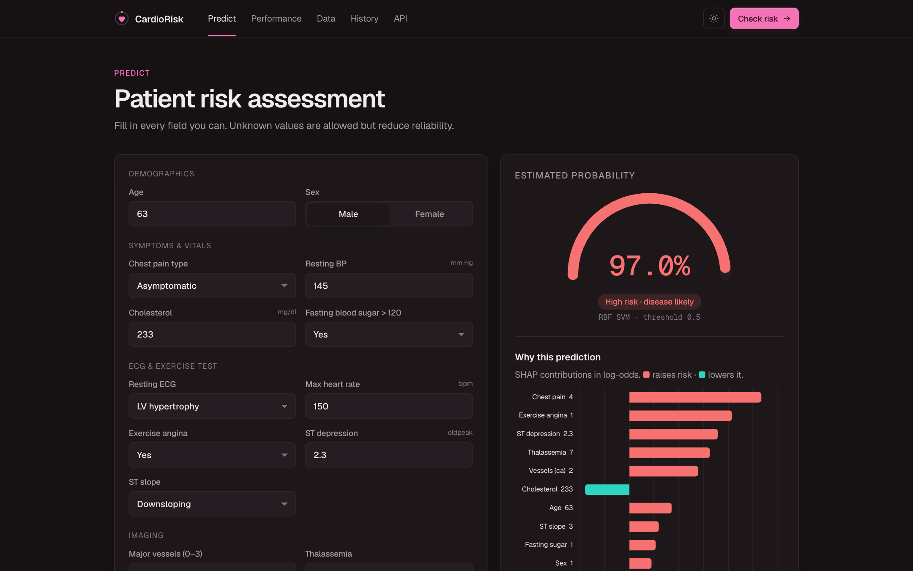
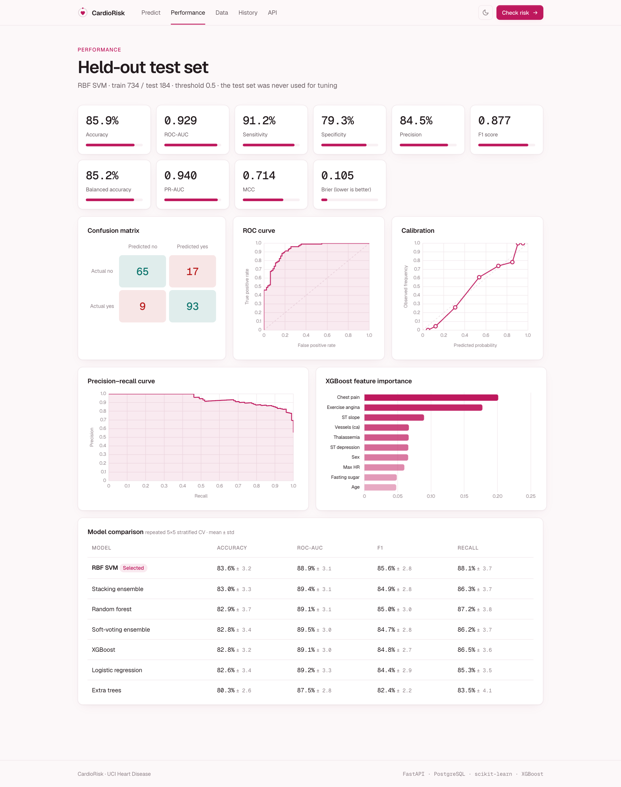
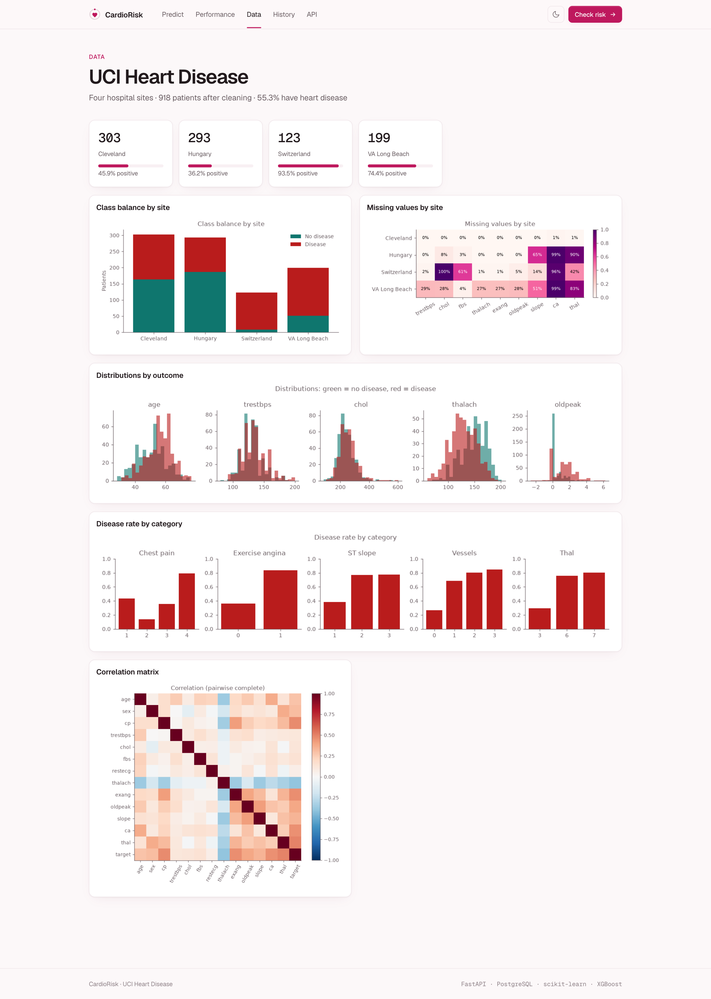
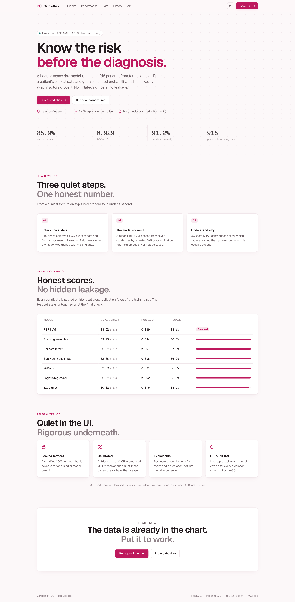
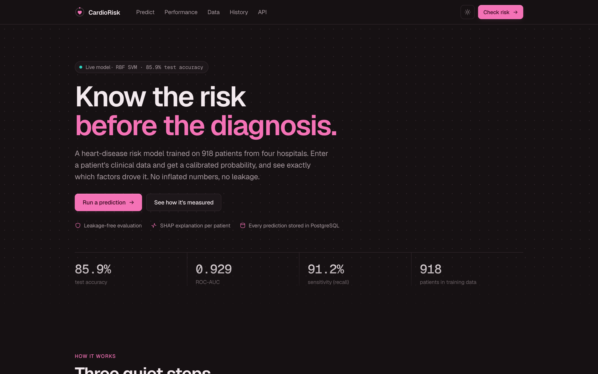
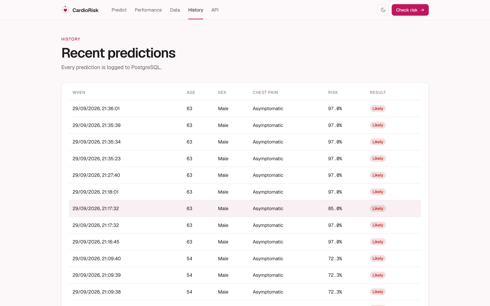
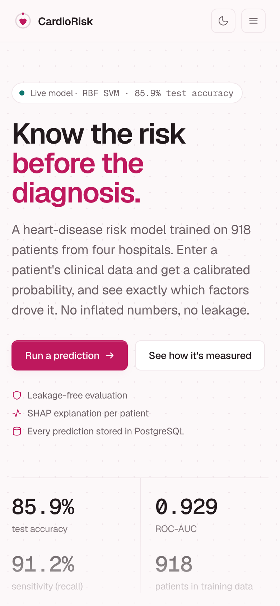
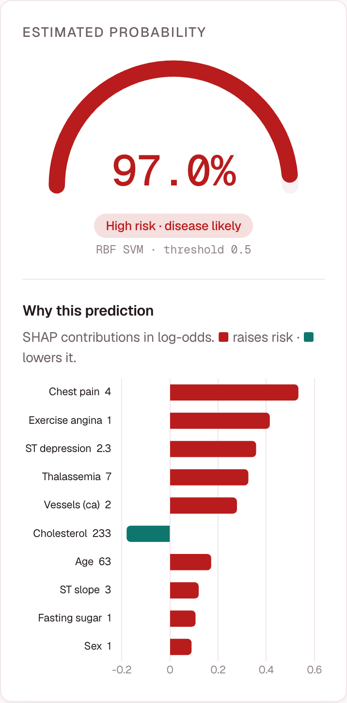

<div align="center">

# ♥ CardioRisk

**Heart-disease risk prediction with honest, leakage-free evaluation and a per-patient explanation of every prediction.**

Python · pandas · scikit-learn · XGBoost · Optuna · PostgreSQL · SQLAlchemy · FastAPI · Chart.js · Docker

`85.9%` test accuracy · `0.929` ROC-AUC · `91.2%` sensitivity · 918 patients · 4 hospitals



</div>

---

## Contents
- [Overview](#overview)
- [Screenshots](#screenshots)
- [Results](#results)
- [How it works](#how-it-works)
- [Quick start](#quick-start)
- [API](#api)
- [Project structure](#project-structure)
- [Testing](#testing)
- [Design system](#design-system)
- [Limitations & disclaimer](#limitations--disclaimer)

---

## Overview

CardioRisk predicts whether a patient has heart disease from 13 routine clinical measurements (age,
chest-pain type, blood pressure, cholesterol, ECG, exercise-test results and fluoroscopy). For each
prediction it returns:

- a **probability** that is well calibrated (Brier score 0.105),
- a **risk label** (high / moderate / low),
- a **SHAP explanation** of which factors pushed that patient's risk up or down.

It's built end to end: data ingestion and cleaning, a PostgreSQL store, a tuned and cross-validated
model comparison, a FastAPI backend, a custom web UI (light and dark themes, mobile friendly), a
data-exploration report, Docker packaging and tests.

**Honesty first.** Many "heart disease" projects online report 95–100% accuracy. Those numbers
usually come from a Kaggle file that contains the same 303 patients about three times, so test rows
leak into training. CardioRisk uses the original UCI data, keeps a test set that is never touched
during tuning, and fits all preprocessing inside cross-validation folds. The numbers below are what
you can expect on new patients.

---

## Screenshots

### Prediction with explanation
| Light | Dark |
|---|---|
|  |  |

### Model performance dashboard
Ten test-set metrics, confusion matrix, ROC, calibration and precision-recall curves, feature
importance, and the cross-validated comparison of all seven models.



### Data exploration


<details>
<summary><b>More screenshots</b>: full landing page, dark home, history, mobile</summary>

#### Landing page


#### Dark theme


#### Prediction history (stored in PostgreSQL)


#### Mobile
<p>

&nbsp;&nbsp;

</p>
</details>

---

## Results

Held-out 20% test set (184 patients), never used for tuning or model selection:

| Metric | Value | | Metric | Value |
|---|---|---|---|---|
| **Accuracy** | **85.9%** | | Precision | 84.5% |
| ROC-AUC | 0.929 | | F1 | 0.877 |
| Sensitivity (recall) | 91.2% | | Balanced accuracy | 85.2% |
| Specificity | 79.3% | | MCC | 0.714 |
| PR-AUC | 0.940 | | Brier score | 0.105 |

**Model comparison** (repeated 5×5 stratified cross-validation on the training set):

| Model | CV accuracy | ROC-AUC |
|---|---|---|
| **RBF SVM (selected)** | **83.6% ± 3.2** | 0.889 |
| Stacking ensemble | 83.0% ± 3.3 | 0.894 |
| Random forest | 82.9% ± 3.7 | 0.891 |
| Soft-voting ensemble | 82.8% ± 3.4 | 0.895 |
| XGBoost | 82.8% ± 3.2 | 0.891 |
| Logistic regression | 82.6% ± 3.4 | 0.892 |
| Extra trees | 80.3% ± 2.6 | 0.875 |

A further 15 experiments (different imputers, engineered features, feature pruning, CatBoost,
LightGBM, other ensembles) all landed at 82–84% CV accuracy. That is this dataset's ceiling. The two
strongest predictors (`ca`, `thal`) are missing for about 95% of patients outside Cleveland. See
[`knowledge.md`](knowledge.md) §8 for the full log.

---

## How it works

```
UCI files ──► clean ──► PostgreSQL ──► leakage-safe pipeline ──► Optuna tuning (5×5 CV)
                         heart_raw      impute + scale + one-hot     7 candidates compared
                         heart_clean    (fitted inside folds)        best refit on all data
                                                                          │
         Browser UI ◄── FastAPI ◄── model.joblib + SHAP explainer ◄──────┘
      (predict · performance ·   /api/predict ──► predictions table
         data · history)
```

1. **Data**: the four UCI *processed* files (Cleveland, Hungary, Switzerland, VA Long Beach; the
   same data as the Kaggle mirror) are merged into 920 rows.
2. **Cleaning**: `?` becomes missing; physiologically impossible zeros (172 cholesterol values) become
   missing; out-of-range codes become missing; duplicates are dropped (918 rows); the target is
   binarised (`num > 0`).
3. **Preprocessing**: median imputation with missing-value indicators, scaling, and one-hot
   categoricals, all inside an sklearn `Pipeline`. XGBoost uses native NaN and categorical handling.
4. **Modelling**: Logistic regression, random forest, SVM and XGBoost, each tuned with 80 Optuna trials
   on repeated stratified 5×5 CV, plus extra trees, soft-voting and stacking ensembles.
5. **Selection & evaluation**: best mean CV accuracy (ties broken by ROC-AUC), then one final check on
   the locked test set.
6. **Explanation**: an XGBoost model trained alongside provides per-feature SHAP contributions for
   each prediction.
7. **Serving**: FastAPI validates inputs (Pydantic), predicts, explains, and logs every prediction to
   PostgreSQL.

---

## Quick start

### Option A: Docker (easiest)
```bash
docker compose up --build
```
Open **http://localhost:8000**. This starts PostgreSQL 16 and the app; the trained model ships in
the image. Use `APP_PORT=8001 docker compose up` to change the port.

### Option B: Local
Requirements: Python 3.11+ and PostgreSQL 14+.

```bash
python3 -m venv .venv && .venv/bin/pip install -r requirements.txt
cp .env.example .env                          # set DATABASE_URL if not using the default
createdb heart_disease
.venv/bin/python -m src.heart.train           # download, clean, load, tune, evaluate, EDA (~8 min)
.venv/bin/uvicorn api.main:app --port 8000    # http://localhost:8000
```

A trained model is already committed in `models/`, so you can skip the training step and go straight
to `uvicorn`. You still need to run `python -m src.heart.data` once to load the data into Postgres.

### Configuration (`.env`)
| Variable | Default | Purpose |
|---|---|---|
| `DATABASE_URL` | `postgresql+psycopg://localhost/heart_disease` | SQLAlchemy connection string |
| `OPTUNA_TRIALS` | `80` | Tuning trials per model (lower for quick runs) |

---

## API

Interactive docs at **`/docs`** (Swagger UI).

| Method | Path | Description |
|---|---|---|
| `POST` | `/api/predict` | Probability, label and SHAP explanation; logged to `predictions` |
| `GET` | `/api/metrics` | Full evaluation report (test metrics, curves, CV comparison) |
| `GET` | `/api/history?limit=25` | Recent predictions |
| `GET` | `/api/health` | App and database health |

```bash
curl -X POST localhost:8000/api/predict -H 'Content-Type: application/json' -d '{
  "age": 63, "sex": 1, "cp": 4, "trestbps": 145, "chol": 233, "fbs": 1, "restecg": 2,
  "thalach": 150, "exang": 1, "oldpeak": 2.3, "slope": 3, "ca": 2, "thal": 7
}'
```
```json
{
  "probability": 0.9698, "label": 1, "threshold": 0.5, "model": "svm",
  "explanation": [ { "feature": "cp", "value": 4, "contribution": 0.53 }, "…" ]
}
```

Only `age`, `sex` and `cp` are required; any other field may be `null`.

<details>
<summary><b>Input fields</b></summary>

| Field | Meaning | Values |
|---|---|---|
| `age` | Age in years | 1–120 |
| `sex` | Sex | 1 male, 0 female |
| `cp` | Chest-pain type | 1 typical angina, 2 atypical, 3 non-anginal, 4 asymptomatic |
| `trestbps` | Resting blood pressure (mm Hg) | 50–250 |
| `chol` | Serum cholesterol (mg/dl) | 80–700 |
| `fbs` | Fasting blood sugar > 120 mg/dl | 0 / 1 |
| `restecg` | Resting ECG | 0 normal, 1 ST-T abnormality, 2 LV hypertrophy |
| `thalach` | Maximum heart rate | 50–230 |
| `exang` | Exercise-induced angina | 0 / 1 |
| `oldpeak` | ST depression induced by exercise | −3 to 7 |
| `slope` | Slope of peak-exercise ST segment | 1 up, 2 flat, 3 down |
| `ca` | Major vessels coloured by fluoroscopy | 0–3 |
| `thal` | Thalassemia | 3 normal, 6 fixed defect, 7 reversible defect |
</details>

---

## Project structure

```
├── src/heart/
│   ├── config.py        # paths, feature lists, .env loading
│   ├── db.py            # SQLAlchemy engine + ORM models (model_runs, predictions)
│   ├── data.py          # download, clean, write heart_raw / heart_clean
│   ├── preprocess.py    # leakage-safe ColumnTransformer, XGBoost native frame
│   ├── train.py         # Optuna tuning, CV comparison, selection, evaluation
│   ├── evaluate.py      # metrics + ROC / PR / calibration curves
│   ├── predict.py       # inference + SHAP explanation
│   └── eda.py           # exploration plots for the Data page
├── api/main.py          # FastAPI app, also serves the UI
├── web/                 # index.html · styles.css · app.js · eda/ (generated plots)
├── models/              # model.joblib · metrics.json
├── data/raw/            # original UCI files
├── tests/               # 10 tests: cleaning, leakage, models, metrics, API, config
├── docs/screenshots/
├── Dockerfile · docker-compose.yml · docker-entrypoint.sh
├── knowledge.md         # domain notes, data issues, experiment log
├── IMPLEMENTATION_PLAN.md
└── UI_DESIGN_SYSTEM.md  # reusable UI spec (see below)
```

**Database tables:** `heart_raw` (as downloaded), `heart_clean` (cleaned + target), `model_runs`
(parameters and metrics for each training run), `predictions` (every UI/API prediction).

---

## Testing

```bash
.venv/bin/python -m pytest -q tests
```

The tests cover the cleaning rules, a check that imputers are fitted on training data only
(no leakage), a minimum accuracy for each model family, metric correctness, `.env` precedence, and
API behaviour (including validation errors and partial inputs).

---

## Design system

The UI follows a warm, minimal design system documented in full in
[`UI_DESIGN_SYSTEM.md`](UI_DESIGN_SYSTEM.md): colour tokens (a terracotta theme and the rose
healthcare theme used here), typography, components, animations, chart theming and a QA checklist.
Give that file to Claude in another project to reproduce the same look.

Highlights: light and dark themes with no flash on load, scroll-reveal and count-up animations, an
animated risk gauge, loading placeholders, full keyboard focus styles, `prefers-reduced-motion`
support, and a responsive layout down to 375px. Every text colour passes WCAG AA contrast.

---

## Limitations & disclaimer

- The data is small (918 patients) and dates from 1988; three of the four sites are missing many
  values.
- A blank cholesterol field raises predicted risk, because in the training data blank cholesterol
  came mostly from the Swiss cohort, where 93% of patients had disease. Fill in every field you can.
- The model was never validated on an external, modern population.

> **CardioRisk is an educational decision-support demo, not a medical device.** Do not use it for
> diagnosis or treatment decisions.

**Data source:** Janosi, A., Steinbrunn, W., Pfisterer, M., & Detrano, R. (1988). *Heart Disease*.
UCI Machine Learning Repository. https://doi.org/10.24432/C52P4X
